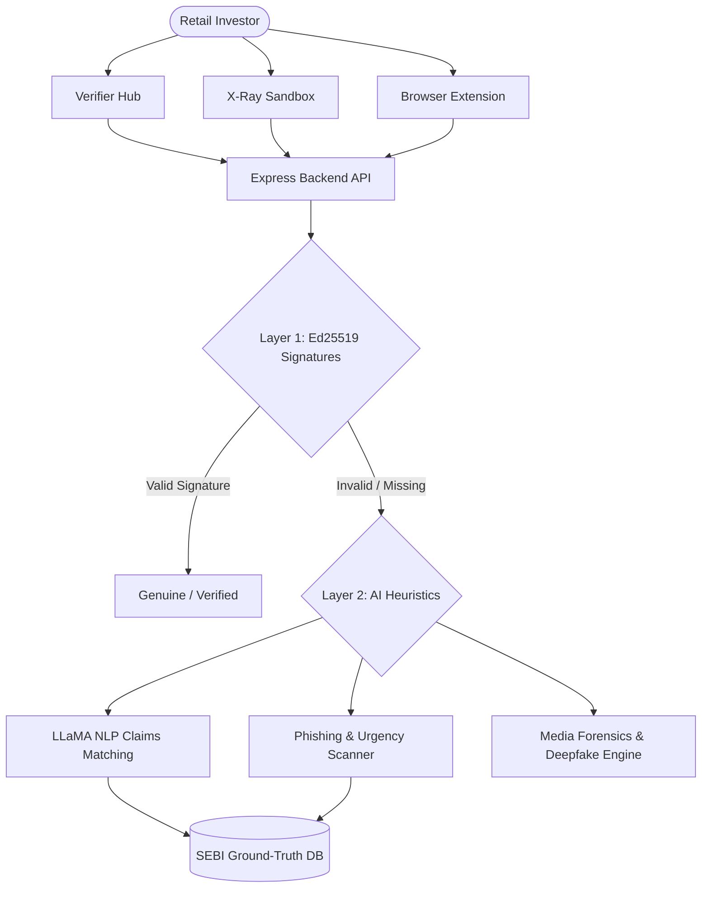

<div align="center">
  
  <br/><br/>
  <h1>🛡️ SatyaCheck</h1>
  <p><strong>The Enterprise-Grade AI Authenticity Backbone for India's Securities Markets</strong></p>
  
  <p>
    
    
    
    
    
    
    
    
  </p>
  
  <p>
    <a href="https://satyacheck.mayankiitj.in"><b>View Live Demo</b></a> •
    <a href="#-core-modules"><b>Explore Modules</b></a> •
    <a href="#-quick-start"><b>Quick Start</b></a>
  </p>
</div>

---

## 📖 Overview

**SatyaCheck** is a next-generation, zero-trust security and verification ecosystem designed specifically to combat market manipulation, financial fraud, and AI-generated deepfakes in the modern securities market. 

Engineered as a robust specification for the SEBI Hackathon, SatyaCheck provides absolute verifiable provenance for official financial claims, circulars, and executive media.

### The Two-Layer Trust Architecture

1. **Layer 1 (Cryptographic Provenance):** Utilizing Ed25519 signatures and C2PA manifests to guarantee 100% authenticity of official documents and media at the byte level.
2. **Layer 2 (AI Heuristics Engine):** Powered by LLaMA 3.1 and advanced forensic metadata parsers (Sharp) to proactively catch unsigned anomalies, deepfakes, phishing attempts, and stock pumping claims against ground-truth registries.

---

## ✨ Core Modules

SatyaCheck operates as a comprehensive, interconnected SaaS ecosystem:

*   **🛡️ Verifier Hub:** The central nervous system. Drag and drop PDFs, media files, or paste text to instantly scan for cryptographic signatures or AI-detected anomalies.
*   **🔍 X-Ray Deepfake Sandbox:** A powerful, interactive media forensics engine. Upload videos or images to run real-time metadata analysis (EXIF, ICC, Alpha channels) combined with LLM visual analysis to detect synthetic manipulation, voice cloning, and deepfakes.
*   **🔑 Intermediary Portal:** A dedicated, secure zone for registered brokers to cryptographically sign and publish their communications onto the chain of trust.
*   **🕸️ "Patient Zero" Heatmap:** A beautiful 3D interactive visualization tracking the exact spread vectors of fraudulent pump-and-dump rumors across social networks.
*   **🕵️ Zero-Knowledge (ZKP) Whistleblower Drop:** A portal for corporate insiders to submit cryptographic proof of fraud without ever revealing their identity.
*   **🌐 Proactive Typo-squatting Radar:** A continuous monitoring dashboard that scans global domain registries to instantly identify and flag fake clone sites targeting SEBI brokers.
*   **🗣️ Vernacular Scam Interceptor:** Simulates intercepting scam calls in regional languages and playing automated warnings in the exact same dialect.

---

## 🏗️ Architecture Flow



---

## 🚀 Quick Start

The repository is built as a robust monorepo containing a Next.js (React) frontend and a Node.js/Express backend.

### Prerequisites
*   Node.js (v18+)
*   NPM or Yarn

### 1️⃣ Start the Backend Engine
The backend is powered by Express, Prisma (SQLite), and integrates with our LLaMA AI services.

```bash
cd backend
npm install
npm run db:push
npm run db:seed
npm run dev
```
> *The backend development server will start at `http://localhost:4000`*

### 2️⃣ Start the Frontend Dashboard
The frontend is a modern Next.js application featuring glassmorphism, Framer Motion micro-animations, and GSAP.

```bash
cd frontend
npm install
npm run dev
```
> *The frontend will be live at `http://localhost:3000`*
> *Note: The Next.js config automatically proxies `/api` requests to the backend to completely eliminate CORS issues.*

---

## 📡 Key API Endpoints

The backend exposes a suite of RESTful endpoints designed for extreme scale:

*   `GET /api/health` - Ping the backend (used by the frontend's wake-up routine).
*   `POST /api/satyacheck/text-verify` - **NLP Engine:** Scans text for pump-and-dump claims, urgency triggers, and matches against SEBI registries.
*   `POST /api/satyacheck/media-verify` - **Forensics Engine:** Accepts `multipart/form-data` uploads. Extracts metadata via Sharp and runs LLM vision checks for deepfake anomalies.
*   `GET /api/features/heatmap` - Returns the 3D network graph payload.
*   `GET /api/features/clone-radar` - Returns live typo-squatting threats.
*   `GET /api/features/xray` - Returns the preloaded deepfake queue data for the sandbox.

---

## 🛡️ Enterprise Security & Scalability

*   **Advanced Next.js Proxying:** Completely mitigates CORS and Mixed Content issues by seamlessly routing frontend requests through an internal proxy to the isolated backend engine.
*   **Zero-Trust Media Processing:** Files uploaded to the X-Ray engine for verification are analyzed entirely in-memory using `multer.memoryStorage()` and instantly discarded, ensuring total privacy.
*   **Stateless Cryptography:** The backend verifies Ed25519 signatures completely statelessly using public keys, allowing infinite horizontal scaling under heavy market load.
*   **Fault-Tolerant UI:** The frontend leverages `AbortSignal` timeouts, graceful fallbacks, and beautiful loading states (via `lucide-react` and `framer-motion`) to ensure investors never experience a broken UI, even during API cold-starts on Render.

---

<div align="center">
  <br/>
  <i>Engineered with absolute precision for the future of secure financial markets.</i>
</div>
