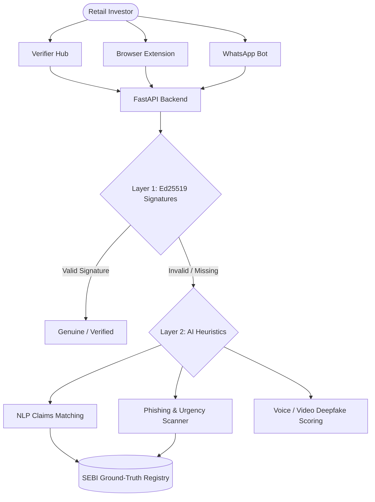

<div align="center">
  
  <br/>
  <h1>🛡️ SatyaCheck</h1>
  <p><strong>AI-Driven Detection & Authenticity Backbone for Securities Markets</strong></p>
  
  <p>
    
    
    
    
    
    
  </p>
</div>

---

## 📖 Overview

**SatyaCheck** is a next-generation security and verification ecosystem designed specifically to combat market manipulation, financial fraud, and deepfakes in the securities market. Built as a specification for the SEBI Hackathon, SatyaCheck acts as a zero-trust architecture verifying the provenance and authenticity of financial claims, circulars, and notices.

It employs a strict **Two-Layer Trust Architecture**:
1. **Layer 1 (Provenance):** Cryptographic Ed25519 signatures and C2PA manifests to guarantee 100% authenticity of official documents and media.
2. **Layer 2 (AI Heuristics):** Advanced NLP and media classifiers to catch unsigned anomalies, deepfakes, phishing attempts, and stock pumping claims against ground-truth registries.

---

## ✨ Core Modules

SatyaCheck isn't just a single app; it's an entire ecosystem:

*   **🛡️ Verifier Hub:** The central nervous system. Drag and drop PDFs, media files, or paste text to instantly scan for cryptographic signatures or AI-detected anomalies.
*   **🔑 Intermediary Portal:** A dedicated zone for registered brokers to cryptographically sign and publish their communications.
*   **🕸️ "Patient Zero" Heatmap:** A 3D interactive visualization showing how a fraudulent pump-and-dump rumor is spreading across social networks.
*   **🕵️ Zero-Knowledge (ZKP) Whistleblower Drop:** A portal for corporate insiders to submit proof of fraud without revealing their identity.
*   **🔍 Deepfake "X-Ray" Sandbox:** An interactive video player that highlights the exact anomalies (lip-sync, unnatural blinking) the AI caught.
*   **🌐 Proactive Typo-squatting Radar:** A dashboard that continuously monitors global domain registries for fake clone sites of SEBI brokers.
*   **🗣️ Vernacular Scam Interceptor:** Simulates intercepting scam calls in regional languages and playing automated warnings in the same language.

---

## 🏗️ Architecture



---

## 🚀 Quick Start (Local Development)

The repository is split into a monolithic structure containing both the Next.js frontend and the Node.js/Express backend.

### Prerequisites
*   Node.js (v18+)

### 1️⃣ Start the Backend
The backend is powered by Express and Prisma and contains the APIs and mock AI models.

```bash
cd backend
npm install
npm run db:push
npm run db:seed
npm run dev
```
> *The backend will be live at `http://127.0.0.1:8000`*

### 2️⃣ Start the Frontend
The frontend is a modern Next.js application with Three.js and GSAP.

```bash
cd frontend
npm install
npm run dev
```
> *The frontend will be live at `http://localhost:3000`*

---

## 📡 API Endpoints

The backend exposes several critical endpoints for ecosystem integration:

*   `GET /api/health` - Check backend health status.
*   `POST /api/verify` - **Core Engine:** Applies Layer 1 and Layer 2 checks.
*   `GET /api/heatmap` - Returns the 3D network graph data for pump-and-dump tracking.
*   `POST /api/whistleblower` - Submits a ZKP verified tip.
*   `GET /api/clone-radar` - Returns live typo-squatting threats.
*   `POST /api/vernacular-check` - Simulates regional language scam call analysis.
*   `POST /api/xray` - Returns deepfake bounding box telemetry for the sandbox player.

---

## 🛡️ Security & Scalability Notes

*   **Robust Fetch Handling:** The frontend is strictly hardened with `AbortSignal` timeouts and HTTP 4xx/5xx interception to ensure no eternal buffering occurs if the network drops.
*   **Stateless Verification:** The backend verifies Ed25519 signatures completely statelessly using public keys, allowing infinite horizontal scaling for the `/api/verify` endpoint.
*   **Privacy-First:** Files uploaded for verification are analyzed in-memory and instantly discarded.

---
<div align="center">
  <i>Built with precision for the future of secure markets.</i>
</div>
